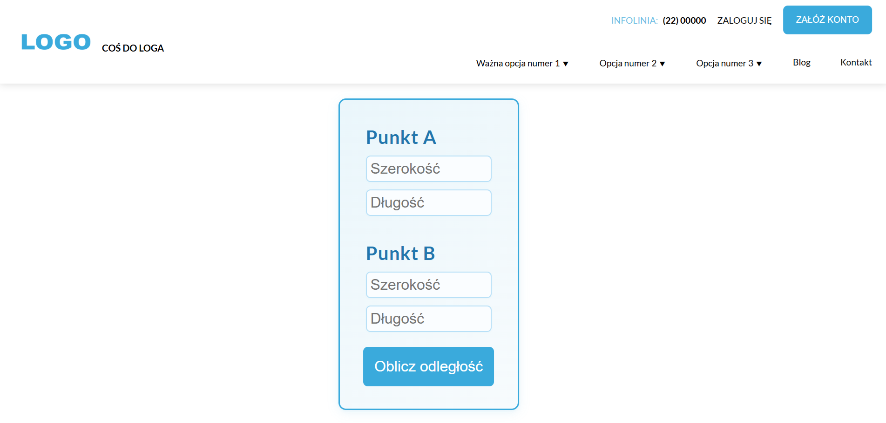
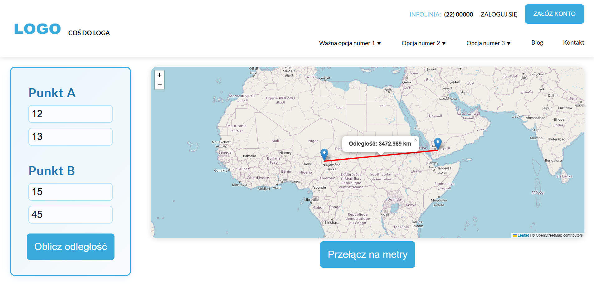

# Kalkulator Odległości

Aplikacja webowa do obliczania odległości pomiędzy dwoma punktami geograficznymi na mapie.  
Projekt wykonany w ramach zadania rekrutacyjnego.

## Funkcjonalności

- Wprowadzanie współrzędnych dwóch punktów (A i B)
- Obliczanie odległości w kilometrach i metrach (backend PHP)
- Przełączanie jednostek (km/metry)
- Wizualizacja punktów i linii na mapie (Leaflet)
- Responsywny interfejs użytkownika
- Rozwijane menu nawigacyjne

## Technologie

- **Frontend:** Vue 3 + Vite
- **Mapa:** Leaflet
- **Backend:** PHP (API do obliczania odległości)
- **Testy:** Vitest, Vue Test Utils

## Uruchomienie lokalne

1. **Klonuj repozytorium:**

   ```bash
   git clone https://github.com/t-rogalski/distancecalculator.git
   cd distancecalculator
   ```

2. **Zainstaluj zależności:**

   ```bash
   npm install
   ```

3. **Uruchom aplikację (frontend + backend PHP):**

   ```bash
   npm run dev
   ```

   - Frontend: http://localhost:5173
   - Backend PHP: http://localhost:8000

4. **Otwórz przeglądarkę i przejdź na** [http://localhost:5173](http://localhost:5173)

## Struktura projektu

- `src/` – kod źródłowy aplikacji Vue
- `src/components/` – komponenty Vue (formularz, mapa, navbar, wynik)
- `src/assets/` – zasoby statyczne (czcionki, obrazki)
- `backend/` – plik PHP do obliczania odległości
- `tests/` – testy jednostkowe

## Testowanie

Aby uruchomić testy jednostkowe:

```bash
npm run test
```

## Zrzuty ekranu

  


## Autor

Projekt wykonał Tomasz Rogalski  
Wykonano w ramach zadania rekrutacyjnego.

---

Dziękuję za poświęcony czas na zapoznanie się z projektem!
